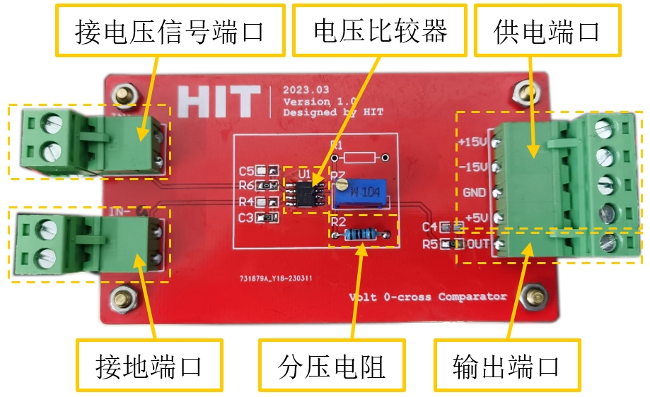

# Zero-Crossing-Detection-Module 

> **交流电压过零检测模块**

## 总体方案

基于LM311D的电压过零比较器/过零检测模块，输出电压过零中断信号，可以用于低压配电电路过零/选相合闸。

过零检测模块由电压信号端口、接地端口、电压比较器芯片、分压电阻、供电端口和输出端口组成。PCB长9cm、宽5cm。

过零检测原理：LM311电压比较器芯片内部由一个运放和一个NPN型三极管构成，运放的输出端连接NPN三极管基极。运放输入正向端电压大于反向端时，三极管导通；反之，三极管关断。将外部信号连接至运放输入正向端，GND连接至运放输入反向端，配合工作于开关状态的三极管，即可实现过零检测。

## 典型应用

> **硬件过零比较锁相/选相合闸**

电压信号端口接交流电压传感器输出端；C3，C5为输入信号RC低通滤波预留电容焊盘，如果输入信号杂波不严重建议不焊，避免引入延时；类似的，C4为输出信号RC低通滤波预留电容焊盘，如果环境干扰不严重建议不焊，避免引入延时；R1，R2选一个焊（选一个三极管集电极电源），输出信号连接STM32单片机外部中断端口，调节R7使得输出为高电平时，电压3.3V。

选相合闸电路各级波形如下图所示，电压互感器输出波形为周期50ms的正弦波，STM32单片机中断端口接收波形为周期50ms，峰峰值3.3V的方波，STM32单片机内部延时锁相波形为周期50ms，峰峰值360°的三角波。

